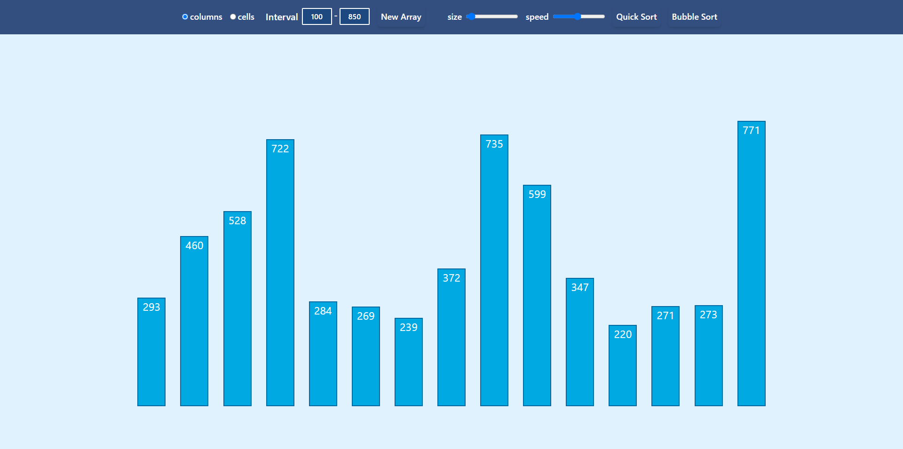

# Sorting Algorithm Visualizer

This project is a web application that visualizes sorting algorithms by displaying an array of numbers as columns or cells, and animating the process of sorting using either the QuickSort or MergeSort algorithm. Users can adjust various settings to customize the visualization and gain insights into how sorting algorithms work.

## Features

- **Algorithm Selection**: Users can choose between QuickSort and MergeSort algorithms to visualize their sorting mechanisms.

- **Array Size and Number Interval**: Users can enter the size of the array and the range of numbers to be sorted. The application generates a random array based on the user's input.

- **Animation Speed Control**: Users can adjust the speed of the animation to see the sorting process in real-time.

- **Visualization Modes**: Users can choose between two visualization modes: displaying numbers as columns or cells, enhancing the learning experience.

### Screenshot

## How to Use

1. Open the Sorting Algorithm Visualizer in your browser.
2. Enter the desired array size and interval of numbers to be sorted.
3. Adjust the animation speed using the speed control.
4. Select the visualization mode (columns or cells) for displaying the array.
5. Choose the sorting algorithm (QuickSort or MergeSort) initiate the sorting algorithm animation.
6. Watch the animation to observe how the chosen sorting algorithm works on the array.

## Technical Details

- The application is built using **React** for the user interface and user interactions.
- **QuickSort** and **MergeSort** algorithms are implemented to sort the array and provide the animation effect.
- User inputs are processed to generate a random array within the specified range.
- The animation is powered by React's state updates, providing a step-by-step visual representation of the sorting process.

## Disclaimer

This application is intended for educational purposes to help users better understand how sorting algorithms work. The visualization is not intended to be a precise representation of the algorithm's performance.

## Project Setup

1. Clone this repository to your local machine.
2. Install the required dependencies using `npm install`.
3. Run the application using `npm start`.

## Links

- GitHub Repository: [github.com/abramishvilisaba/sorting-algorithm-visualization](https://github.com/abramishvilisaba/sorting-algorithm-visualization)
- Live Demo: [sabramishvili-sorting-algorithm.netlify.app](https://sabramishvili-sorting-algorithm.netlify.app/)

## Author

- GitHub: [abramishvilisaba](https://github.com/abramishvilisaba/sorting-algorithm-visualization)
- 
## Contributing

Contributions to this project are welcome! If you find a bug or have suggestions for improvements, please feel free to open an issue or submit a pull request.

## License

This project is licensed under the [MIT License](LICENSE). You are free to use, modify, and distribute the code for your purposes.

